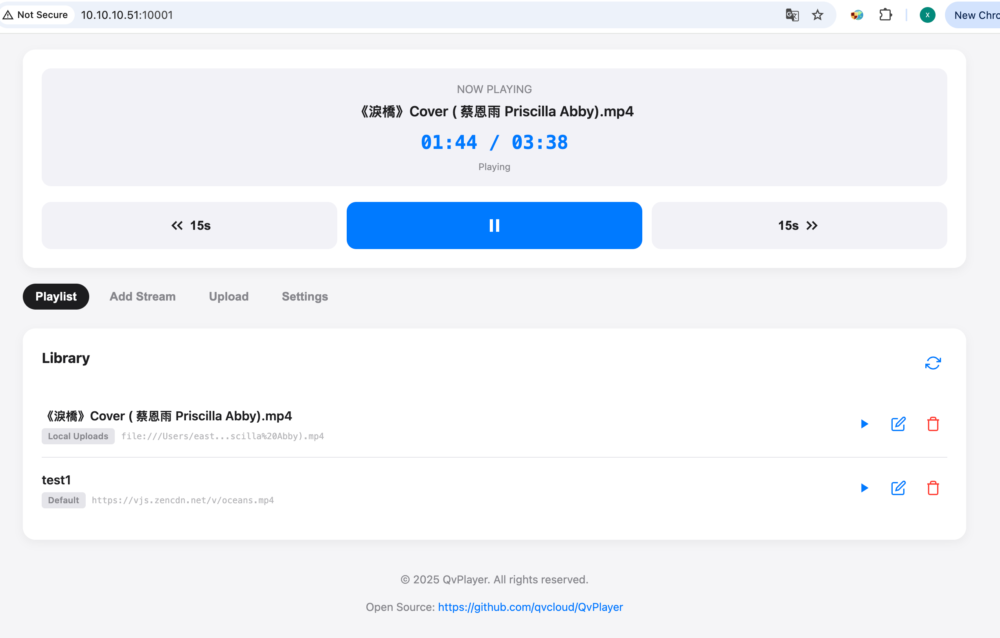

# QvPlayer for tvOS

QvPlayer is a powerful and flexible video player designed specifically for Apple TV (tvOS). It combines the efficiency of the native system player with the versatility of FFmpeg, ensuring playback support for a wide range of video formats including MP4, MKV, AVI, and modern codecs like AV1.

## ✨ Key Features

*   **Dual Playback Engines**:
    *   **System Player (AVPlayer)**: Best for standard formats (H.264, HEVC/H.265). Uses hardware decoding for maximum battery efficiency and performance.
    *   **KSPlayer (FFmpeg)**: A robust fallback engine that supports virtually any format (MKV, AVI, WMV, FLV) and codecs that the system might not support natively (e.g., AV1).
*   **Web Management Interface**: Built-in web server allows you to manage playlists and upload files directly from your computer's browser.
*   **Smart Codec Detection**: Automatically detects unsupported codecs (like AV1 on older hardware) and suggests switching to the appropriate player engine.
*   **Playlist Management**: Create and organize your video collections.
*   **Native tvOS UI**: Designed with SwiftUI to feel right at home on the big screen.
*   **Localization**: Fully localized in English and Simplified Chinese (简体中文).

## 🚀 Getting Started

### Requirements

*   Xcode 15.0 or later
*   tvOS 16.0 or later
*   Swift 5.9+

### Installation

1.  **Clone the repository**:
    ```bash
    git clone https://github.com/yourusername/QvPlayer.git
    cd QvPlayer
    ```

2.  **Open the project**:
    Open `QvPlayer.xcodeproj` in Xcode.

3.  **Resolve Dependencies**:
    The project uses Swift Package Manager (SPM). Xcode should automatically fetch the required packages:
    *   [KSPlayer](https://github.com/kingslay/KSPlayer)
    *   [FFmpegKit](https://github.com/kingslay/FFmpegKit)

4.  **Build and Run**:
    Select your Apple TV simulator or connected device and press `Cmd + R`.

## 📖 Usage

### Importing Videos

There are two ways to get videos into QvPlayer:

1.  **Web Transfer (Recommended)**:
    *   Open QvPlayer on your Apple TV.
    *   Note the IP address displayed on the settings or home screen (e.g., `http://192.168.1.x:10001`).
    *   Open that URL in a web browser on your computer.
    *   Drag and drop video files to upload them directly to the Apple TV.

2.  **iTunes File Sharing**:
    *   Connect your Apple TV to your Mac (or use wireless debugging).
    *   Open Finder (or iTunes on older macOS).
    *   Navigate to the "Files" tab for the Apple TV.
    *   Drag video files into the QvPlayer documents folder.

### Switching Player Engines

If you encounter a video with sound but no image (black screen), it is likely using a codec not supported by the native player (e.g., AV1).

1.  Go to **Settings** within the app.
2.  Change **Player Engine** from `System` to `KSPlayer`.
3.  Resume playback.

## � Screenshots

| Home | Player |
|:---:|:---:|
|  |  |

| Settings | Web Control |
|:---:|:---:|
|  |  |

## �🛠 Tech Stack

*   **Language**: Swift
*   **UI Framework**: SwiftUI
*   **Architecture**: MVVM
*   **Core Libraries**:
    *   `AVKit` / `AVFoundation` (System Playback)
    *   `KSPlayer` (FFmpeg-based Playback)
    *   `GCDWebServer` (implied custom implementation in `Utilities/WebServer.swift`)

## 📝 License

This project is for educational and personal use. Please refer to the licenses of third-party libraries (KSPlayer, FFmpegKit) for their respective usage terms.
