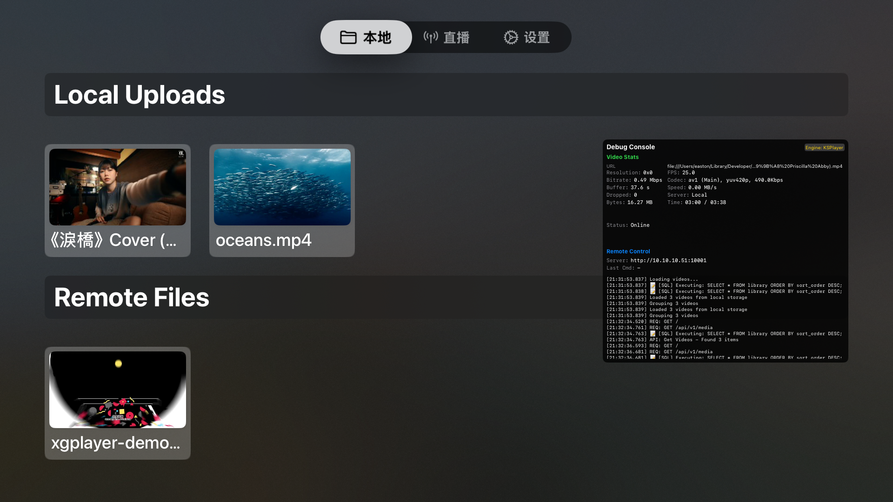
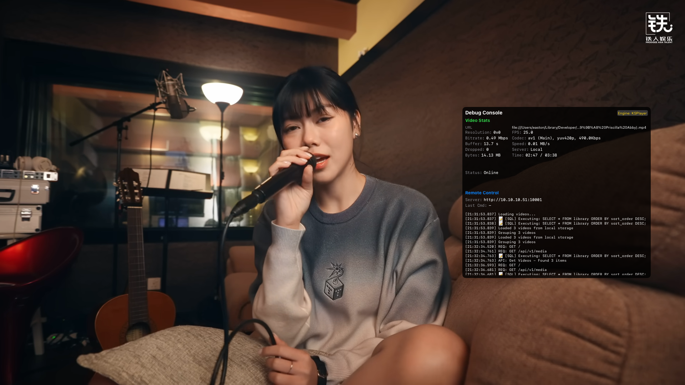

# QvPlayer for tvOS

QvPlayer 是一款专为 Apple TV (tvOS) 设计的强大且灵活的视频播放器。它结合了原生系统播放器的高效性与 FFmpeg 的多功能性，确保支持广泛的视频格式，包括 MP4、MKV、AVI 以及 AV1 等现代编码格式。

## ✨ 主要功能

*   **双播放引擎**:
    *   **系统播放器 (AVPlayer)**: 最适合标准格式 (H.264, HEVC/H.265)。利用硬件解码实现最高的电池效率和性能。
    *   **KSPlayer (FFmpeg)**: 强大的备用引擎，支持几乎所有格式 (MKV, AVI, WMV, FLV) 以及系统本身不支持的编码 (如 AV1)。
*   **Web 管理界面**: 内置 Web 服务器，允许你直接通过电脑浏览器管理播放列表、上传文件以及配置播放器。
    *   **播放队列管理**: 轻松添加、移除或重新排序播放队列中的项目。
    *   **远程控制**: 直接从 Web 界面控制播放（播放、暂停、快进快退）。
*   **高度可定制化 (亮点)**:
    *   **自定义播放参数**: 支持配置硬件解码、快速打开、RTSP 传输协议（TCP/UDP）以及缓冲时长。
    *   **自定义 User-Agent**: 内置多种常用 UA（Chrome, Safari, iPhone 等），并支持完全自定义 UA 以绕过某些流媒体限制。
    *   **代理支持**: 支持配置 HTTP 代理，方便访问受限资源。
    *   **自定义端口**: Web 管理界面端口可自定义（默认：12345）。
*   **智能播放队列**: 
    *   支持 **Pending/Playing/Played** 状态追踪。
    *   支持 **循环播放**: 全局设置，支持整个队列或单视频的无限循环播放。
    *   自动跳过失效链接。
*   **后台测速系统**: 自动检测直播流或视频链接的可用性及加载速度，并在 UI 中实时反馈。
*   **M3U 播放列表支持**: 支持导入和管理 M3U 格式的直播源。
*   **原生 tvOS UI**: 使用 SwiftUI 设计，完美适配大屏幕操作体验，支持焦点引擎。
*   **多语言支持**: 完全支持简体中文和英文。

## 🚀 快速开始

### 环境要求

*   Xcode 15.0 或更高版本
*   tvOS 16.0 或更高版本
*   Swift 5.9+

### 安装步骤

1.  **克隆仓库**:
    ```bash
    git clone https://github.com/yourusername/QvPlayer.git
    cd QvPlayer
    ```

2.  **打开项目**:
    在 Xcode 中打开 `QvPlayer.xcodeproj`。

3.  **解析依赖**:
    项目使用 Swift Package Manager (SPM)。Xcode 应该会自动获取所需的包：
    *   [KSPlayer](https://github.com/kingslay/KSPlayer)
    *   [FFmpegKit](https://github.com/kingslay/FFmpegKit)
    *   [GCDWebServer](https://github.com/swisspol/GCDWebServer)

4.  **构建并运行**:
    选择你的 Apple TV 模拟器或连接的设备，然后按 `Cmd + R`。

## 📖 使用指南

### 导入视频与直播源

1.  **Web 传输 (推荐)**:
    *   在 Apple TV 上打开 QvPlayer。
    *   记下设置或主屏幕上显示的 IP 地址 (例如 `http://192.168.1.x:12345`)。
    *   在电脑浏览器中打开该 URL。
    *   **上传文件**: 将视频文件拖放到网页中。
    *   **添加链接**: 在网页端输入视频流地址或上传 M3U 文件。
    *   **配置播放器**: 在 Web 端设置页面调整 UA、代理或播放参数。

2.  **iTunes 文件共享**:
    *   将 Apple TV 连接到 Mac。
    *   在 Finder 中导航到 Apple TV 的“文件”选项卡，将视频拖入 QvPlayer 文件夹。

### 播放队列管理

*   **添加至队列**: 在主页长按视频或在 Web 端点击“添加到队列”。
*   **自动播放**: 队列中的视频会按顺序自动播放。
*   **状态追踪**: 播放器会自动记录哪些视频已播放，哪些正在等待。

### 测速系统

*   App 会在后台自动对列表中的视频源进行测速。
*   测速结果会以颜色或标签形式显示在视频缩略图上，帮助你选择最流畅的源。

### 切换播放引擎

如果你遇到视频**有声音但无画面**（黑屏）的情况：
1.  进入 App 内的 **设置 (Settings)**。
2.  将 **播放引擎 (Player Engine)** 从 `System` 切换为 `KSPlayer`。

## 🛠 技术栈

*   **语言**: Swift 5.9+
*   **UI 框架**: SwiftUI
*   **架构**: MVVM + Services
*   **核心组件**:
    *   `MediaManager`: 核心业务逻辑，处理播放队列和媒体库。
    *   `SpeedTestManager`: 后台并发测速引擎。
    *   `CacheManager`: 媒体元数据与缓存管理。
    *   `WebServer`: 基于 GCDWebServer 的远程管理接口。
    *   `DatabaseManager`: 基于 JSON/File 的轻量级持久化。

## 📸 截图展示

| 主页 | 播放器 |
|:---:|:---:|
|  |  |

## 📝 许可证

MIT License - 详见 [LICENSE](LICENSE) 文件。
